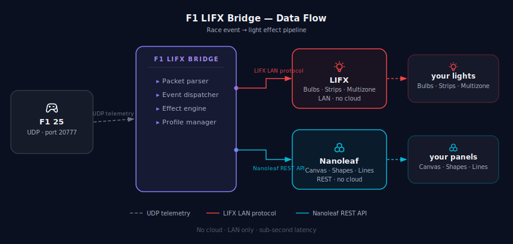

# F1 LIFX Bridge

Sync your LIFX and Nanoleaf lights to live F1 25 race events. Start lights, yellow flags, fastest laps, safety car — every moment on track reflected in your room.

---

## How it works

F1 25 broadcasts telemetry over UDP on your local network. This app listens for those packets, parses the event data, and sends the corresponding lighting effect to your LIFX bulbs/strips and Nanoleaf panels over LAN — no cloud, no API keys, sub-second latency.



---

## Features

**Race Events**
- Start lights sequence (zones fill red one by one on multizone strips)
- Lights out (green flash)
- Yellow flag / Safety car
- Blue flag
- Red flag
- Fastest lap (purple)
- Chequered flag
- White warning / Black flag
- Track clear / Neutral return

**Lights**
- Discover all LIFX bulbs and strips on your LAN
- Select which lights respond to events
- Save and load light groups
- Stagger lights (fire each bulb with a configurable delay)
- Master brightness range (min / max scaling)
- Idle mode with custom color and optional slow pulse

**Multizone Strips**
- Zone sweep on start lights (fills zones left-to-right or right-to-left)
- Configurable direction per-strip
- Dedicated green-to-red zone fill test

**Nanoleaf**
- Supports Canvas, Shapes, Lines, Elements, Light Panels
- One-time pairing via local REST API (no cloud required)
- Manual IP entry for pairing *(auto-discovery currently not working — [#23](https://github.com/onxtane/f1-lifx-bridge/issues/23))*
- All race effects fire on LIFX and Nanoleaf simultaneously
- Panel Layout UI — visualise your physical panel arrangement and drag panels to match your real-world setup
- Start lights sweep across panels by physical position (bottom→top or top→bottom), matching the LIFX multizone behaviour
- Configurable sweep direction shared with the LIFX multizone setting

**App**
- Profiles — save and switch complete configurations (lights, effects, settings)
- Light Assignment — assign specific lights to specific effects
- Intensity Curves — per-effect brightness curve editor (preview, backend coming)
- UDP forwarding — relay packets to a second destination (sim dashboard software, etc.)
- Built-in tutorial overlay
- Live packet and event log

---

## Requirements

- Python 3.10+
- F1 25 on PC with UDP telemetry enabled
- LIFX bulbs or strips on the same LAN
- Nanoleaf device on the same LAN *(optional)*

### Python dependencies

```
pip install pywebview PySide6 lifxlan nanoleafapi requests
```

---

## Setup

**1. Enable F1 25 UDP telemetry**

In-game: Settings → Telemetry Settings

| Setting | Value |
|---|---|
| UDP Telemetry | On |
| UDP Broadcast Mode | Off |
| UDP IP Address | your PC's local IP (e.g. `192.168.1.x`) |
| UDP Port | `20777` (default) |
| UDP Send Rate | 60Hz recommended |
| Your Telemetry | Public |

**2. Run the app**

```bash
python main.py
```

**3. Discover your lights**

Go to the Lights page → click Discover Lights → select the bulbs you want to use.

**4. Start the bridge**

Click **Start Bridge** on the Dashboard. It opens the UDP listener and stays running in the background. You only need to do this once per session.

---

## Project structure

```
f1_lifx_app/
├── main.py                  # pywebview window + JS API layer
├── bridge_runner.py         # threading wrapper, stat polling
├── bridge_core.py           # UDP listener, packet parsing, LIFX effects
├── nanoleaf_controller.py   # Nanoleaf REST API integration
└── ui/
    └── index.html           # full single-file UI
```

---

## Configuration files

These are created automatically on first run and are not tracked in git (user-specific):

| File | Contents |
|---|---|
| `f1lifx_gui_settings.json` | Port, IP, brightness, stagger, idle color, enabled events |
| `lifx_groups.json` | Saved light groups |
| `nanoleaf_settings.json` | Nanoleaf IP, auth token, device info, panel layout *(gitignored)* |

---

## Known issues

| # | Issue |
|---|---|
| [#1](https://github.com/onxtane/f1-lifx-bridge/issues/1) | Tailscale / VPN connections can break LIFX discovery |
| [#3](https://github.com/onxtane/f1-lifx-bridge/issues/3) | Entire app flickers when F1 25 comes into focus |
| [#4](https://github.com/onxtane/f1-lifx-bridge/issues/4) | Scroll wheel hitbox too large in Discovered Lights section |
| [#22](https://github.com/onxtane/f1-lifx-bridge/issues/22) | Panel Layout UI: first panel renders as hexagon on Canvas (NL29) |
| [#23](https://github.com/onxtane/f1-lifx-bridge/issues/23) | Nanoleaf auto-discovery not working — manual IP entry required |

---

## Roadmap

**In progress**
| # | Item |
|---|---|
| [#5](https://github.com/onxtane/f1-lifx-bridge/issues/5) | Intensity Curves — backend implementation |

**Enhancements**
| # | Item |
|---|---|
| [#6](https://github.com/onxtane/f1-lifx-bridge/issues/6) | Formation Lap effect |
| [#11](https://github.com/onxtane/f1-lifx-bridge/issues/11) | Mini mode — compact always-on-top window |
| [#12](https://github.com/onxtane/f1-lifx-bridge/issues/12) | Expanded multizone strip effects (sectors, RPM, tyres) |
| [#15](https://github.com/onxtane/f1-lifx-bridge/issues/15) | Toast notification when saving profile settings |
| [#21](https://github.com/onxtane/f1-lifx-bridge/issues/21) | Validate IPv4 format on UDP listen IP input |

**UI**
| # | Item |
|---|---|
| [#8](https://github.com/onxtane/f1-lifx-bridge/issues/8) | Discovered lights slider overlaps light buttons |
| [#9](https://github.com/onxtane/f1-lifx-bridge/issues/9) | Section dividers disappear when Effects section is expanded |
| [#10](https://github.com/onxtane/f1-lifx-bridge/issues/10) | Replace emoji placeholders with SVG icon glyphs |
