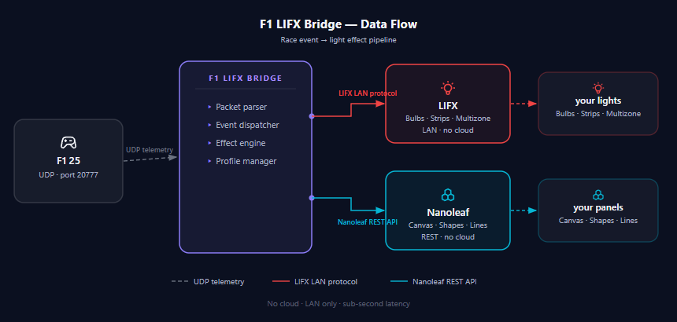

# GridGlow

Sync your LIFX, Nanoleaf, and Philips Hue lights to live sim racing events. Start lights sweep red zone by zone, yellow flags pulse amber, fastest laps go purple — every moment on track reflected in your room.

Supports **F1 25** and **F1 24** via EA Sports UDP telemetry. More titles coming.

---

## How it works

F1 25/24 broadcasts telemetry over UDP on your local network. GridGlow listens for those packets, parses the event data, and sends the corresponding lighting effect to your LIFX, Nanoleaf, and Hue devices over LAN — no cloud, no API keys, sub-second latency.



---

## Features

**Race Events**
- Start lights sequence — zones fill red one by one on multizone strips and Nanoleaf panels
- Lights out — green flash
- Yellow flag / Safety car — amber pulse
- Blue flag — blue pulse
- Red flag — urgent strobe
- Fastest lap — purple flash
- Chequered flag
- White warning / penalty
- Track clear / neutral return

**Supported Lights**
- **LIFX** — bulbs, colour strips, multizone strips (zone-by-zone sweep)
- **Nanoleaf** — Canvas, Shapes, Lines, Elements, Light Panels (Panel Layout UI for position-based sweep)
- **Philips Hue** — full bulb support via local CLIP v2 API; Gradient Lightstrip Plus per-segment control (hardware validation pending [#44](https://github.com/onxtane/f1-lifx-bridge/issues/44))

**Light Control**
- Discover lights on your LAN
- Select which lights respond to which events (Light Assignment)
- Save and load light groups (Profiles)
- Master brightness range (min / max scaling)
- Stagger mode — fire each bulb with a configurable delay
- Identify button — flash a single bulb to confirm which one it is
- Idle mode — custom colour with optional slow pulse

**App**
- Game selector — choose your title on launch; "Remember my choice" skips the screen next time
- Mini mode — compact 380×100 always-on-top window
- Profiles — save and switch complete configurations
- UDP forwarding — relay packets to a second destination (sim dashboard, second PC)
- Built-in tutorial overlay
- Live packet and event log

---

## Supported Games

| Game | Status |
|------|--------|
| F1® 25 | ✅ Supported |
| F1® 24 | ✅ Supported |
| F1® 2021–2023 | 🔜 Planned — [#46](https://github.com/onxtane/f1-lifx-bridge/issues/46) |
| Forza Horizon 5 / Motorsport | 🔜 Planned — [#47](https://github.com/onxtane/f1-lifx-bridge/issues/47) |
| DiRT Rally 2.0 / EA WRC | 🔜 Planned — [#48](https://github.com/onxtane/f1-lifx-bridge/issues/48) |
| Assetto Corsa | 🔜 Planned — [#49](https://github.com/onxtane/f1-lifx-bridge/issues/49) |
| Project CARS 2 | 🔜 Planned — [#50](https://github.com/onxtane/f1-lifx-bridge/issues/50) |

See the full roadmap at [gridglow.pages.dev/roadmap](https://gridglow.pages.dev/roadmap) or [#31](https://github.com/onxtane/f1-lifx-bridge/issues/31).

---

## Requirements

- Windows 10/11 *(macOS support in development — [#45](https://github.com/onxtane/f1-lifx-bridge/issues/45))*
- F1 25 or F1 24 on PC with UDP telemetry enabled
- LIFX, Nanoleaf, or Philips Hue device on the same LAN

### Running from source

```
pip install pywebview PySide6 lifxlan nanoleafapi requests psutil
python main.py
```

---

## Setup

**1. Enable UDP telemetry in F1 25 or F1 24**

In-game: Settings → Telemetry Settings

| Setting | Value |
|---|---|
| UDP Telemetry | On |
| UDP Broadcast Mode | Off |
| UDP IP Address | your PC's local IP (e.g. `192.168.1.x`) |
| UDP Port | `20777` (default) |
| UDP Send Rate | 60 Hz recommended |
| Your Telemetry | Public |

**2. Run the app**

Launch the `.exe` from the release, or run `python main.py` from source.

**3. Set up your lights**

On first launch the brand picker will guide you through pairing your lights. You can also reach it later via Settings.

**4. Select your game and start the bridge**

The game selector appears on launch. Pick your title, click **Launch**, then **Start Bridge** on the dashboard.

---

## Project structure

```
f1_lifx_app/
├── main.py                  # pywebview window + JS API layer
├── bridge_runner.py         # threading wrapper, settings dispatch
├── bridge_core.py           # UDP listener, packet parsing, LIFX effects
├── nanoleaf_controller.py   # Nanoleaf local REST API
├── hue_controller.py        # Philips Hue CLIP v2 local API
└── ui/
    └── index.html           # full single-file UI
```

---

## Configuration files

Created automatically on first run. Not tracked in git.

| File | Contents |
|---|---|
| `f1lifx_gui_settings.json` | Port, IP, brightness, stagger, idle colour, enabled events, profiles |
| `lifx_groups.json` | Saved light groups |
| `nanoleaf_settings.json` | Nanoleaf IP, auth token, panel layout *(gitignored — contains credentials)* |
| `hue_settings.json` | Hue bridge IP, application key *(gitignored — contains credentials)* |

---

## Known issues

| # | Issue |
|---|---|
| [#1](https://github.com/onxtane/f1-lifx-bridge/issues/1) | Tailscale / VPN connections can break LIFX discovery |
| [#3](https://github.com/onxtane/f1-lifx-bridge/issues/3) | App flickers when F1 comes into focus |
| [#22](https://github.com/onxtane/f1-lifx-bridge/issues/22) | Panel Layout UI: first panel renders as hexagon on Canvas (NL29) |
| [#23](https://github.com/onxtane/f1-lifx-bridge/issues/23) | Nanoleaf auto-discovery not working — manual IP required |
| [#44](https://github.com/onxtane/f1-lifx-bridge/issues/44) | Hue Gradient Lightstrip detection needs hardware validation |
